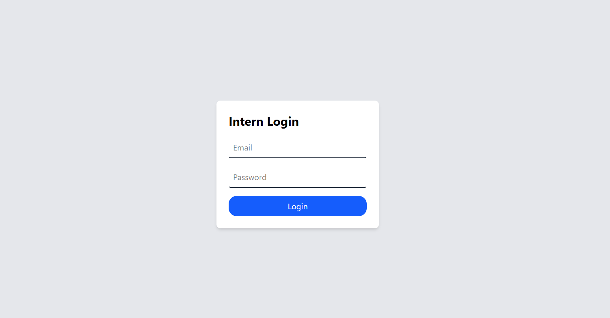
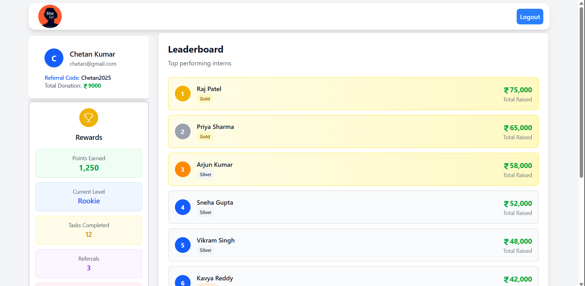

# Fundraising Intern Portal (Round 1 Assignment)

A basic full-stack **Intern Dashboard Portal** designed for fundraising interns.  
This portal lets interns log in (dummy), track their performance, view leaderboards, rewards, referrals, and personal progress — all in one clean dashboard interface.

---
## 🔥 Features Implemented

- Dummy **login/signup** screen (no authentication)
- Intern **Dashboard** with:
  - Personal information (name, email, referral code, amount raised)
  - Reward section (points, tasks completed, referrals)
  - **Leaderboard** showing top-performing interns
  - Logout option

---
## 📸 Screenshots

> Login & Dashboard Preview
  

---

## 🚀 Getting Started

Follow these steps to run the project locally:

```bash
# 1. Clone the repository
https://github.com/AvusalaChetan/Full-Stack-Developer-Internship-Round-1-Task..git

# 2. Install dependencies
npm install

# 3. Start the project
npm start

App will start at → http://localhost:3000
```
